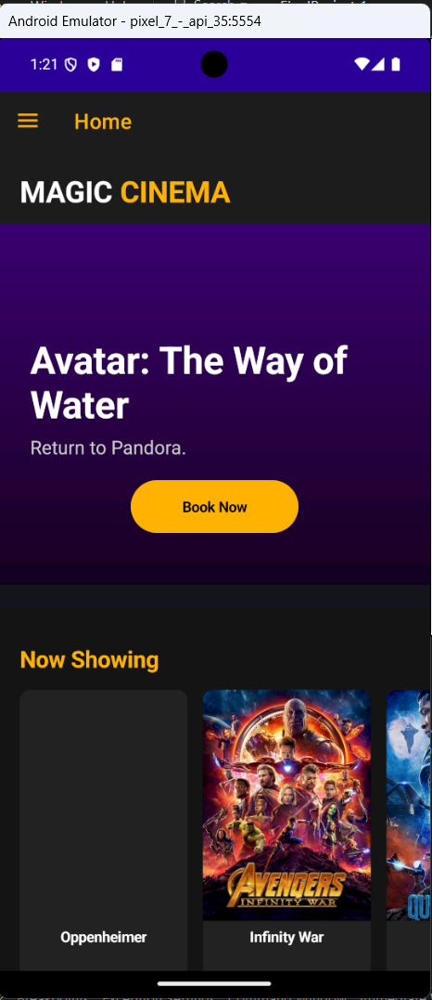
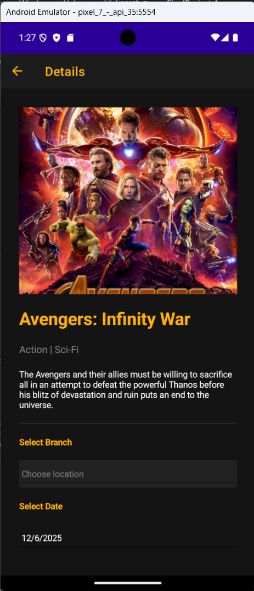
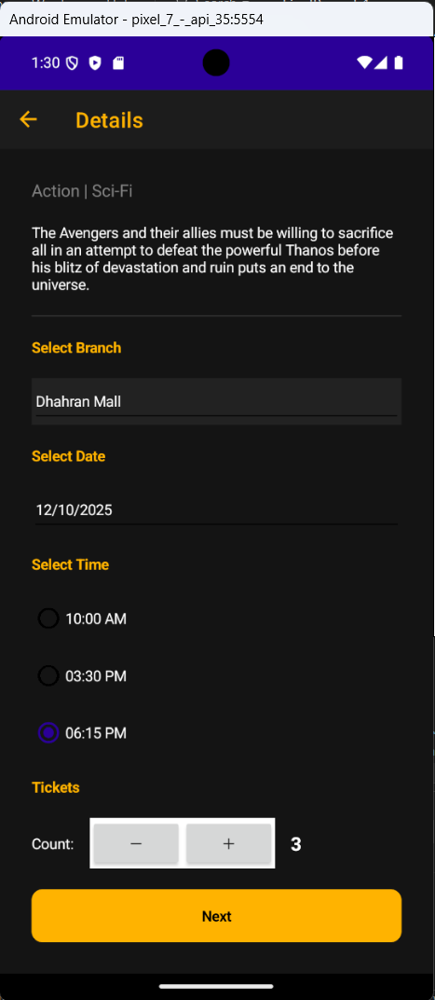

# Magic Cinema 🎬

Magic Cinema is a modern, cross-platform mobile application designed to make booking movie tickets seamless, intuitive, and engaging. Users can browse current and upcoming movies, view showtimes, select seats, and manage their ticket reservations all from a sleek digital interface.

## 🚀 Features

* **Movie Catalog:** Browse trending, currently showing, and upcoming movies with high-quality posters and descriptions.
* **Showtime Selection:** Filter movies by date, timing, and preferred cinema halls.
* **Interactive Seat Selection:** View a real-time layout of the theater to pick preferred seats.
* **Profile & Booking History:** Keep track of active tickets, previous bookings, and user preferences.
* **Modern UI/UX:** A clean, visually compelling dark-mode aesthetic tailored for cinema enthusiasts.

## 🛠️ Tech Stack

* **Framework:** .NET MAUI / C#
* **IDE:** Visual Studio

## 📦 Installation & Setup

To run this project locally, follow these steps:

1. **Clone the repository:**
   ```bash
   git clone [https://github.com/YOUR_USERNAME/YOUR_REPOSITORY_NAME.git](https://github.com/YOUR_USERNAME/YOUR_REPOSITORY_NAME.git)

## 📸 Screenshots

### 🔑 Authentication & Main Hub
| Login Screen | Sign Up | Home Screen |
|--- |--- |--- |
|  |  |  |

### 🎬 Movie Details & Booking Flow
| Movie Details (Top) | Movie Details (Info) | Payment | Booking Success |
|--- |--- |--- |--- |
|  |  |  |  |
